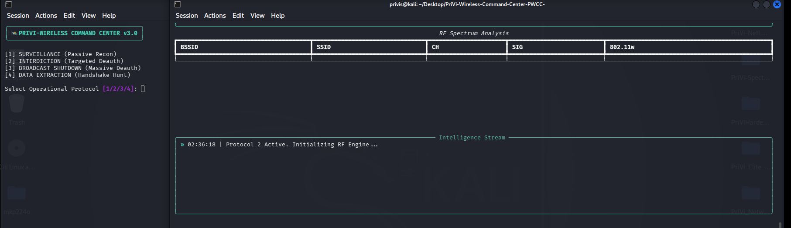

<div align="center">

# 🛡️ PriVi Wireless Command Center (PWCC) v6.0: Developed by PriViSecurity



</div>

### RF Intelligence & Wireless Audit Platform
**Developed by Prince Ubebe | [PriViSecurity](https://github.com/Privis40)**

---

## ⚠️ Legal Notice

> **This tool is intended ONLY for use on wireless networks you own or have explicit written authorization to audit.**
> Deauthentication testing against networks you do not own is illegal under the Computer Misuse Act, the CFAA, and equivalent cybercrime laws worldwide.
> **PriViSecurity accepts no liability for unauthorized or malicious use of this tool.**

---

## What It Does

PriVi Wireless Command Center is a professional wireless security audit platform combining passive RF surveillance, live client MAC detection, device fingerprinting, signal tracking, evil twin detection, hidden SSID exposure, EAPOL handshake capture, session timeline logging, PCAP export, and deauthentication testing — all in a single Rich terminal dashboard with a branded PDF audit report.

---

## Features

| Feature | Description |
|---|---|
| 📡 Passive Surveillance | Live two-panel dashboard: networks + connected clients |
| 👥 Client MAC Detection | Discovers client MACs from data, probe, and association frames |
| 🏭 Device Fingerprinting | Resolves MAC OUI to manufacturer (Apple, Samsung, TP-Link, etc.) |
| 📊 Signal Sparkline | ASCII signal strength trend graph per AP updated in real time |
| 🏃 Client Activity Score | Ranks clients by frame count — shows who is most active |
| 👾 Evil Twin Detection | Flags APs broadcasting your authorized SSID from a different BSSID |
| 🔓 Hidden SSID Exposure | Captures real SSID when a client associates with a hidden AP |
| 🔐 802.11w MFP Analysis | Detects whether Management Frame Protection is enabled |
| 🤝 EAPOL Handshake Capture | Passive WPA/WPA2 handshake capture |
| 📋 Session Timeline | Every event timestamped — new AP, client joined, evil twin, handshake |
| 💾 PCAP Export | Full session packet capture saved to .cap file on exit |
| ⚠️ Targeted Deauth Test | Auto-scans clients first, then deauths specific client (double-gated) |
| ⚠️ Broadcast Deauth Test | Deauths all clients on AP (double-gated) |
| 📄 PDF Audit Report | Networks, clients, timeline, observations, recommendations |
| 🔧 Auto-Install | Installs missing dependencies automatically on first run |

---

## Requirements

```bash
pip install scapy rich fpdf2
```

Your wireless adapter must be in **monitor mode** before launching. See the Monitor Mode Guide below.

---

## Installation

```bash
git clone https://github.com/Privis40/PriVi-Wireless-Command-Center.git
cd PriVi-Wireless-Command-Center
pip install -r requirements.txt
```

---

## Monitor Mode Guide

> Your adapter must be in monitor mode for PWCC to capture raw 802.11 frames.
> Without it the tool sees nothing.

### Step 1 — Check your wireless adapters

```bash
iwconfig
```

Look for interfaces showing `IEEE 802.11`. Usually named `wlan0`, `wlan1`.

For full details including driver and chipset:

```bash
sudo airmon-ng
```

Example output:
```
PHY     Interface   Driver      Chipset
phy0    wlan0       iwlwifi     Intel Corporation Wireless 8260
```

> **Not all adapters support monitor mode.** Recommended adapters:
> - Alfa AWUS036ACH (best overall)
> - Alfa AWUS036ACS
> - TP-Link TL-WN722N v1 (v2 and v3 do NOT support monitor mode)
> - Panda PAU09
>
> Built-in Intel/Broadcom laptop cards have limited or no monitor mode support.

---

### Step 2 — Kill interfering processes

NetworkManager and wpa_supplicant interfere with monitor mode and will put your adapter back into managed mode. Kill them first:

```bash
sudo airmon-ng check kill
```

Example output:
```
Found 2 processes that could cause trouble.
PID   Name
1656  NetworkManager
1712  wpa_supplicant

Killing interfering processes...
```

---

### Step 3 — Enable monitor mode

```bash
sudo airmon-ng start wlan0
```

Output:
```
PHY     Interface   Driver    Chipset
phy0    wlan0       iwlwifi   Intel Wireless 8260

(mac80211 monitor mode vif enabled on [phy0]wlan0mon)
(mac80211 station mode vif disabled for [phy0]wlan0)
```

Confirm it worked:

```bash
iwconfig wlan0mon
```

You should see `Mode:Monitor`.

---

### Step 4 — Run PWCC

```bash
sudo python3 privi_wireless_cc.py
```

When prompted for the interface, enter `wlan0mon`.

---

### Step 5 — Restore normal WiFi when done

```bash
# Stop monitor mode
sudo airmon-ng stop wlan0mon

# Restart NetworkManager
sudo systemctl restart NetworkManager
```

Confirm WiFi is back:

```bash
iwconfig
```

You should see `wlan0` with `Mode:Managed`.

---

### Quick Reference

```bash
sudo airmon-ng                    # Check adapters
sudo airmon-ng check kill         # Kill interfering processes
sudo airmon-ng start wlan0        # Enable monitor mode
sudo python3 privi_wireless_cc.py # Run PWCC
sudo airmon-ng stop wlan0mon      # Disable monitor mode
sudo systemctl restart NetworkManager  # Restore WiFi
```

---

## Usage

```bash
sudo python3 privi_wireless_cc.py
```

On first run the tool auto-installs any missing packages. On subsequent runs it launches immediately.

The tool will:
1. Display the legal authorization gate — type `AGREE`
2. Prompt for operator name (appears in PDF report)
3. Prompt for monitor-mode interface and authorized SSID/BSSID
4. Present the audit mode menu
5. Run the selected mode
6. On exit (Ctrl+C) — save PCAP and generate PDF report automatically

---

## Audit Modes

### Mode 1 — Passive Surveillance *(Read-only)*

Full-spectrum passive monitoring. Displays a live multi-panel dashboard:
- **Networks panel** — all APs in range with BSSID, SSID, channel, signal, MFP status, client count, manufacturer, and real-time signal sparkline trend
- **Clients panel** — all connected devices with MAC, manufacturer, SSID, AP BSSID, activity score, and last seen time
- **Timeline panel** — every session event with timestamp
- **Stats panel** — alternates with timeline showing totals, MFP coverage, most active client

Run this first. Nothing is transmitted.

---

### Mode 2 — EAPOL Handshake Hunt *(Read-only)*

Same dashboard as Mode 1 but specifically watching for WPA/WPA2 4-way handshake frames. When a device connects to a network it exchanges a handshake with the router — this mode captures those frames passively.

Captured handshakes are saved to the PCAP file on exit for offline analysis.

Nothing is transmitted.

---

### Mode 3 — Targeted Deauth Test *(Active — double authorization gate)*

Disconnects a single specific client from a specific AP.

**How it works:**
1. Automatically scans for 10 seconds — shows all discovered networks and client MACs in a table
2. You copy the client MAC and AP BSSID from the table
3. Choose frame count (see guide below)
4. Deauth frames are sent — client disconnects and reconnects automatically

**Frame count guide:**

| Frames | Duration | Effect |
|---|---|---|
| 50 | ~5 seconds | Brief disconnect |
| 100 | ~10 seconds | Medium disconnect |
| 200 | ~20 seconds | Extended disconnect |

**What this tests:** Whether the client and AP have 802.11w MFP enabled. If MFP is active the client ignores deauth frames and stays connected — pass result. If it disconnects — MFP is not configured — report finding.

Requires `CONFIRM` at secondary gate before any frames are sent.

---

### Mode 4 — Broadcast Deauth Test *(Active — double authorization gate)*

Sends broadcast deauth frames to all clients on a specific AP simultaneously.

Scans 10 seconds first, shows all detected networks with client counts, then prompts for target BSSID and frame count.

**What this tests:** Overall MFP posture of the AP. If all devices drop at once — no MFP — significant finding. If they stay connected — MFP is working.

Requires `CONFIRM` at secondary gate before any frames are sent.

---

## PCAP Analysis with Wireshark

Every PWCC session saves a `.cap` file on exit containing all captured 802.11 frames. Here is how to open and analyse it.

### Opening the PCAP

```bash
# Open directly from terminal
wireshark PWCC_Capture_20260517_143022.cap

# Or open Wireshark and File > Open the .cap file
```

---

### Essential Wireshark Filters for Wireless Analysis

**Show all beacon frames (AP advertisements):**
```
wlan.fc.type_subtype == 0x0008
```

**Show all probe requests (devices scanning for networks):**
```
wlan.fc.type_subtype == 0x0004
```

**Show all probe responses:**
```
wlan.fc.type_subtype == 0x0005
```

**Show association requests (client joining AP):**
```
wlan.fc.type_subtype == 0x0000
```

**Show deauthentication frames:**
```
wlan.fc.type_subtype == 0x000c
```

**Show only EAPOL handshake frames (WPA authentication):**
```
eapol
```

**Filter traffic for a specific AP (replace with your BSSID):**
```
wlan.bssid == aa:bb:cc:dd:ee:ff
```

**Filter traffic for a specific client MAC:**
```
wlan.addr == 11:22:33:44:55:66
```

**Show only data frames:**
```
wlan.fc.type == 2
```

**Show management frames only:**
```
wlan.fc.type == 0
```

**Show deauth frames from a specific source:**
```
wlan.fc.type_subtype == 0x000c && wlan.sa == aa:bb:cc:dd:ee:ff
```

**Show all frames involving your target client:**
```
wlan.addr == 11:22:33:44:55:66 && eapol
```

---

### What to Look For

**EAPOL Handshake Analysis**

Filter: `eapol`

A complete WPA 4-way handshake has exactly 4 EAPOL messages:
- Message 1: AP → Client (ANonce)
- Message 2: Client → AP (SNonce + MIC)
- Message 3: AP → Client (GTK encrypted)
- Message 4: Client → AP (confirmation)

If you see all 4 messages for the same session — you have a complete handshake capture. This can be analysed offline.

In Wireshark right-click any EAPOL frame → Follow → check the stream to see all 4 messages together.

---

**Deauth Frame Analysis**

Filter: `wlan.fc.type_subtype == 0x000c`

What to check:
- **Source address** — who sent the deauth. If it's the AP BSSID — legitimate. If it's a third address — possible deauth attack or your own test.
- **Reason code** — expand the frame, look for `Fixed parameters > Reason code`. Code 7 = Class 3 frame received from nonassociated station (what PWCC sends). Code 3 = Deauthenticated because sending station is leaving.
- **Destination** — `ff:ff:ff:ff:ff:ff` means broadcast (Mode 4). Specific MAC means targeted (Mode 3).

---

**Evil Twin Detection**

Filter:
```
wlan.fc.type_subtype == 0x0008 && wlan.ssid == "YourNetworkName"
```

If you see two different BSSID values for the same SSID — one of them is an evil twin. Compare signal strengths — the rogue AP is usually stronger because it's physically closer.

---

**Client Roaming**

Filter: `wlan.fc.type_subtype == 0x0002`

Reassociation requests show when a client moves between APs (roaming). Look for the same client MAC appearing in reassociation frames with different AP BSSIDs.

---

**Hidden SSID Exposure**

Filter: `wlan.fc.type_subtype == 0x0000`

Association requests always contain the target SSID even if the AP broadcasts as hidden. If PWCC flagged a hidden SSID as revealed, confirm it here by filtering association requests and reading the SSID field.

---

### Wireshark Tips for 802.11 Analysis

**Enable wireless columns** — Go to Edit > Preferences > Columns. Add: RSSI, TX Rate, Channel, BSSID. Makes reading frames much faster.

**Statistics > WLAN Traffic** — Shows a summary of all APs and clients in the capture with frame counts. Great for a quick overview without filtering.

**Statistics > Conversations** — Shows all device pairs communicating. Useful for mapping who is talking to who.

**IO Graph** — Statistics > I/O Graph. Plot EAPOL frames over time to visualise handshake timing.

**Export specific frames** — File > Export Specified Packets. Filter to `eapol` then export just the handshake frames for aircrack-ng analysis on authorized targets.

---

## How Client MAC Detection Works

PWCC captures client MACs from three frame types:

**Probe Request frames** — sent by devices actively scanning for networks. Reveals device MAC before it even connects.

**Association/Reassociation frames** — sent when a device joins a network. Contains client MAC and target AP BSSID.

**Data frames** — sent by any active device transferring data. Most reliable — catches already-connected clients without waiting for re-association.

> **Testing tip:** Connect your phone to your WiFi then browse something or stream video. Active data transfer makes your MAC appear within seconds.

---

## PDF Report Sections

1. Audit Summary (operator, tool, date, mode, networks, clients, handshakes, hidden SSIDs, PCAP file)
2. Detected Networks (BSSID, SSID, channel, signal, MFP, clients)
3. Detected Clients (MAC, SSID, AP BSSID)
4. Security Observations (evil twins, unprotected networks, handshakes, hidden SSIDs)
5. Session Timeline (every event with timestamp)
6. Recommendations
7. Legal & Scope Declaration

---

## What This Tool Does NOT Do

- ❌ Does **not** crack WPA/WPA2 passwords
- ❌ Does **not** inject or modify traffic
- ❌ Does **not** associate with any access point
- ❌ Does **not** perform deauth without explicit double confirmation
- ❌ Does **not** permanently block any device

---

## Tested On

- Kali Linux 2024+ (VM and Live Boot)
- Ubuntu 22.04 / 24.04
- Python 3.10+
- Alfa AWUS036ACH, TP-Link TL-WN722N v1

---

## Author & Brand

**Prince Ubebe**
Cybersecurity Analyst | Security Automation Engineer | Founder, PriViSecurity

- GitHub: [github.com/Privis40](https://github.com/Privis40)
- LinkedIn: [linkedin.com/in/prince-ubebe-291573321](https://www.linkedin.com/in/prince-ubebe-291573321)
- YouTube: [@princeubebecyber](https://youtube.com/@princeubebecyber)
- HackerOne / Bugcrowd: Active researcher

---

## License

This tool is released for **authorized security research and professional use only.**
Redistribution or modification for malicious purposes is strictly prohibited.

© 2026 PriViSecurity. All rights reserved.
